# Architecture

Ants is a background agent harness — the same category as Stripe Minions, Ramp Inspect, and Shopify River. You submit a task; a colony of parallel AI workers executes it in isolated sessions; results come back to you across any interface.

The key insight from Ramp's writeup: the bottleneck in AI coding isn't the LLM, it's the feedback loop. An agent that can write code *and then run tests, check logs, verify visually, and open a PR* is qualitatively different from a chat assistant. Ants is built around closing that loop.

## System Overview



## How a Task Flows



## Deployment Modes



## Package Map

```
apps/
  server/          → Docker-deployable server (Hono + SQLite)
  desktop/         → Electron desktop app
  mobile/          → React Native mobile app

packages/
  core/            → Agent loop, plugin system, context compaction
  agent/           → Full agent assembled from all packages
  node/            → Node.js agent with full filesystem access
  providers/       → LLM adapters: Claude, GPT, Gemini, Groq, xAI, OpenRouter

  tools-terminal/  → bash · read · write · edit · grep
  tools/           → web search · todos · skills
  tools-director/  → spawn/manage sessions, Docker, project settings
  browser-core/    → headless browser control

  server/          → embeddable HTTP/WebSocket server
  mcp-stdio/       → MCP protocol (plug in any external tool)
  lsp/             → Language Server Protocol (code intelligence)
  scheduler/       → cron + event-triggered task scheduling

  database/        → SQLite via Drizzle ORM
  memory/          → semantic memory with local embeddings
  storage/         → session and artifact persistence
  verifiers/       → reward functions for RL evaluation (see below)

  ui/              → shared React chat UI
  cli/             → command-line interface

tests/
  agent-task-tests/   → episode harness + example tasks (see below)
```

## Agent Runtime

Ants runs its own agent — not Claude Code, not OpenCode. The server spawns `ants serve --port <N>` as a subprocess per project and communicates with it over HTTP. The agent itself is built on `@ants/agent-core` and calls LLMs via the Anthropic/OpenAI/etc. API.

This means the loop, compaction policy, permission model, retry logic, tool set, and system prompt are all ants' own code — fully inspectable and modifiable.

### The Agent Loop

`PromptExecutor.runAgentLoop()` is a `for` loop capped at 200 iterations. Each iteration:

```
1. Check if compaction is needed        (iteration 0 only)
2. generateResponse()                   stream from the LLM
3. No tool calls in response?  →  done, return the message
4. executeTools(toolCalls)              run each tool
5. Push tool results as a new "user" message
6. Loop
```

The LLM decides when to stop by not requesting any tools. Two safety valves prevent runaway loops: the 200-iteration cap, and a loop detector that throws if the last 5 consecutive tool call signatures are identical.

### LLM Streaming

Every response is streamed, not awaited in one shot. The provider returns an async iterator of chunks:

- `text` chunks → accumulated into `content`, emitted as `message.delta` events (text appears in the UI in real time)
- `tool_call` chunks → pushed into `toolCalls[]`, emitted as `tool.start` events

Token usage — including prompt cache hits — is recorded after the stream completes.

### Compaction

As a conversation grows, it eventually won't fit in the model's context window. Compaction summarises old history so the agent can keep working indefinitely. There are three layers:

| Layer | When | What |
|---|---|---|
| **Proactive** | Start of every new user turn | If working window > token threshold, summarise before sending anything |
| **Pre-send** | Right before calling the provider | Estimate payload tokens; if > 95% of model limit, compact then truncate |
| **Reactive** | After a context-length error from the API | Emergency compact + truncate, retry once |

Compaction calls the LLM with a fixed prompt asking for a structured summary: Tasks Completed, Files Modified, Key Decisions, Problems Encountered, Current State, Next Steps. The summary is injected as a `[Conversation Summary]` message at position 0. Everything before it is discarded. The **working window** is always defined as: everything from the last summary message to the end of the conversation.

Truncation (last resort) drops message pairs (assistant tool call + user tool result) from position 1 — keeping the summary and the most recent messages — until the payload fits.

### Tool Execution

Each loop iteration may produce multiple tool calls. They are bucketed and executed differently:

| Category | Execution | Determined by |
|---|---|---|
| **Pre-approved** | Parallel (`Promise.all`) | Permission config: always-allow list |
| **Permission-required** | Sequential — pauses to ask user | Permission config: ask mode |
| **Denied** | Immediately return error, no execution | Permission config: deny list |
| **Unknown** | Immediately return "unknown tool" error | Tool not in registry |

Each tool execution is wrapped in `withRetry` (transient failures) and a circuit breaker (persistent failures).

### Full Example

```
User: "fix the login bug"
  │
  ▼
Agent.run()
  → load config, init provider, MCP servers, tools
  │
  ▼
PromptExecutor.runAgentLoop()
  │
  ├─ iteration 0
  │   ├─ compaction check                 working window within limit ✓
  │   ├─ buildLLMMessages()               flatten message history to LLM format
  │   ├─ ensureContextFits()              pre-send token check ✓
  │   ├─ provider.stream(...)             → Claude streams back
  │   │   ├─ emit message.delta           text appears in UI
  │   │   └─ emit tool.start              "calling bash..."
  │   ├─ LLM: call bash("grep -r login src/")
  │   └─ executeTools → push result as user message
  │
  ├─ iteration 1
  │   ├─ LLM sees grep output
  │   ├─ LLM: call edit("src/auth.ts", ...)
  │   └─ executeTools → push result
  │
  ├─ iteration 2
  │   ├─ LLM sees edit result
  │   ├─ LLM: call bash("pnpm test")
  │   └─ executeTools → push result
  │
  └─ iteration 3
      ├─ LLM sees tests pass
      ├─ LLM: "Done. Fixed the null check in validateSession()"
      └─ no tool calls → loop exits ✓
```

### Memory

Separate from conversation messages. `packages/memory` uses ONNX Runtime locally to embed text into vectors and does nearest-neighbour search to surface relevant past context. No external service — the model runs in-process. The `lite` Docker variant strips this and falls back to keyword search.

---

## RL with Verifiable Rewards

Ants includes a lightweight framework for evaluating agent behavior with verifiable reward signals — the same principle used in RLVR training: the agent acts, the environment checks the outcome, a scalar reward is returned.

### How it fits into the agent loop



The harness is intentionally LLM-agnostic: `AgentRunner` is just `(prompt, workspacePath) => Promise<void>`. Swap in a real agent, a fine-tuned model, or a deterministic stub — the verifiers don't care.

### Verifiers (`packages/verifiers`)

Pure functions. Each takes a workspace path, checks one thing, returns a score.

| Verifier | What it checks |
|---|---|
| `fileExists(path)` | file was created |
| `fileContains(path, pattern)` | file contains a string or regex |
| `scriptOutputs(path, expected)` | `node script.js` stdout matches expected |
| `typescriptCompiles(path)` | `tsc --noEmit` exits clean |
| `allPass(verifiers[])` | all must pass — score is the mean |
| `anyPass(verifiers[])` | at least one must pass — score is the max |

All return `{ name, score: 0–1, passed, detail }`. The `detail` field is the debugging surface — it tells you exactly why a reward was 0.5 instead of 1.

### Task harness (`tests/agent-task-tests`)

```
src/
  types.ts      AgentRunner, Task, EpisodeResult
  harness.ts    runEpisode() — setup → run → verify → cleanup

tasks/
  fix-bug.ts       fix an add() that subtracts instead of adding
  add-function.ts  add a missing multiply() function

tests/
  harness.test.ts  7 tests: reward=0, reward=0.5, reward=1 cases
```

`runEpisode(task, runner)` creates an isolated temp directory, calls `task.setup()` to write the broken initial state, runs the agent, evaluates all verifiers, and cleans up. The result is an `EpisodeResult`:

```ts
{
  taskId: string
  reward: number        // mean score across all verifiers
  passed: boolean       // true only when every verifier passes
  verifierResults: VerifierResult[]
  durationMs: number
}
```

### Partial credit

Verifiers compose naturally into partial rewards. A task with two verifiers — `scriptOutputs` and `fileContains` — scores 0.5 if the agent produces the right output but via a different code path than expected. This matters for training: you want a gradient, not just binary pass/fail.

```
reward=0    agent does nothing         both verifiers fail
reward=0.5  agent fixes the logic      scriptOutputs passes, fileContains fails
reward=1    agent fixes correctly      both verifiers pass
```

## Comparison

| | Ramp Inspect | Stripe Minions | Shopify River | **Ants** |
|---|---|---|---|---|
| Infra | Modal cloud sandboxes | Internal cloud | Internal cloud | **Self-hosted / your infra** |
| LLM | Proprietary mix | Proprietary mix | Proprietary mix | **Any: Claude, GPT, Gemini, Groq...** |
| Access | Slack, web, Chrome ext, PRs | Internal | Internal | **Desktop, mobile, CLI, API** |
| Source | Closed | Closed | Closed | **Open source** |
| Multi-agent | Yes | Yes | Yes | **Yes** |
| Feedback loop | Tests + Sentry + Datadog | Tests | Tests | **Tests + LSP + browser** |

The fundamental bet is the same across all four: background agents that close the loop on their own work (write → test → verify → ship) will generate a non-trivial fraction of all code at a team. Ants makes that pattern available to anyone, on any stack, without a proprietary cloud dependency.
