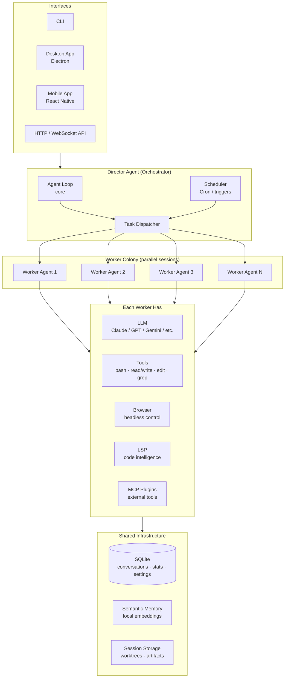
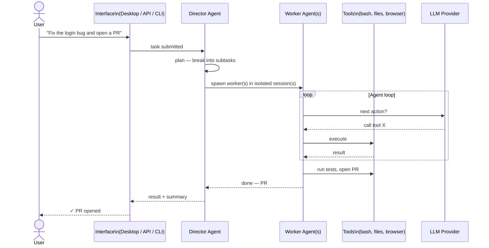
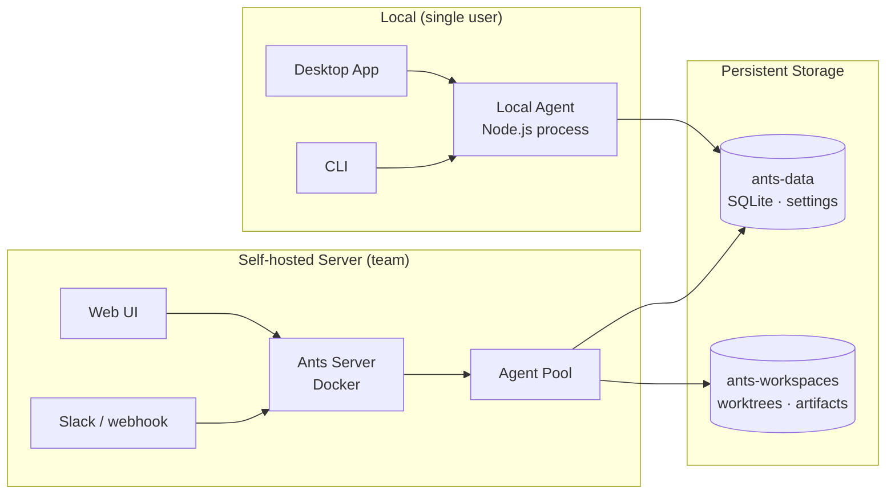

# Architecture

Ants is a background agent harness — the same category as Stripe Minions, Ramp Inspect, and Shopify River. You submit a task; a colony of parallel AI workers executes it in isolated sessions; results come back to you across any interface.

The key insight from Ramp's writeup: the bottleneck in AI coding isn't the LLM, it's the feedback loop. An agent that can write code *and then run tests, check logs, verify visually, and open a PR* is qualitatively different from a chat assistant. Ants is built around closing that loop.

## System Overview



## How a Task Flows



## Deployment Modes



## Package Map

```
apps/
  server/          → Docker-deployable server (Hono + SQLite)
  desktop/         → Electron desktop app
  mobile/          → React Native mobile app

packages/
  core/            → Agent loop, plugin system, context compaction
  agent/           → Full agent assembled from all packages
  node/            → Node.js agent with full filesystem access
  providers/       → LLM adapters: Claude, GPT, Gemini, Groq, xAI, OpenRouter

  tools-terminal/  → bash · read · write · edit · grep
  tools/           → web search · todos · skills
  tools-director/  → spawn/manage sessions, Docker, project settings
  browser-core/    → headless browser control

  server/          → embeddable HTTP/WebSocket server
  mcp-stdio/       → MCP protocol (plug in any external tool)
  lsp/             → Language Server Protocol (code intelligence)
  scheduler/       → cron + event-triggered task scheduling

  database/        → SQLite via Drizzle ORM
  memory/          → semantic memory with local embeddings
  storage/         → session and artifact persistence

  ui/              → shared React chat UI
  cli/             → command-line interface
```

## Comparison

| | Ramp Inspect | Stripe Minions | Shopify River | **Ants** |
|---|---|---|---|---|
| Infra | Modal cloud sandboxes | Internal cloud | Internal cloud | **Self-hosted / your infra** |
| LLM | Proprietary mix | Proprietary mix | Proprietary mix | **Any: Claude, GPT, Gemini, Groq...** |
| Access | Slack, web, Chrome ext, PRs | Internal | Internal | **Desktop, mobile, CLI, API** |
| Source | Closed | Closed | Closed | **Open source** |
| Multi-agent | Yes | Yes | Yes | **Yes** |
| Feedback loop | Tests + Sentry + Datadog | Tests | Tests | **Tests + LSP + browser** |

The fundamental bet is the same across all four: background agents that close the loop on their own work (write → test → verify → ship) will generate a non-trivial fraction of all code at a team. Ants makes that pattern available to anyone, on any stack, without a proprietary cloud dependency.
