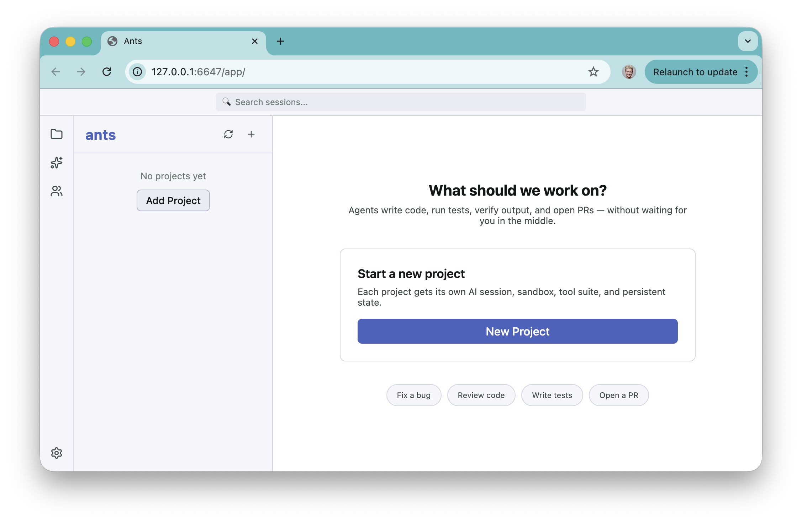

# ants

An open-source background agent platform inspired by [openmgr](https://github.com/openmgr/openmgr). Each project is an isolated environment with its own conversation, sandboxed container, a set of tools, skills, and persistent state — running in parallel on your own infrastructure.

One can think of it as a self-hostable version of [Ramp Inspect](https://builders.ramp.com/post/why-we-built-our-background-agent), Stripe Minions or Shopify River.

## What is this?

The bottleneck in coding these days isn't the model per se, it's closing the feedback loop. An agent that can write code and then run tests, check logs, verify visually, and open a PR is qualitatively different.

Each workspace is a self-contained unit:

| | What it is |
|---|---|
| **Conversation** | Persistent AI chat session: full history, context compaction, branching |
| **Sandbox** | Docker container or git worktree: isolated execution environment |
| **Tools** | bash, file read/write/edit, browser control, LSP, MCP plugins |
| **State** | SQLite per project + semantic memory with local embeddings |

An orchestrator agent sits at the top, breaking tasks into subtasks and dispatching them to a set of parallel workers. Workers close the loop on their own: write code → run tests → check output → open PR, without waiting for a human in the middle.

What makes ants different from some other systems:

- **You own the infra:** runs anywhere Docker runs, no Modal or proprietary cloud sandboxes
- **Any model:** Claude, GPT, Gemini, Groq, xAI, not locked to one provider
- **Every interface:** mobile app, desktop app, CLI, HTTP API
- **Extensible:** MCP plugins wire in Sentry, Datadog, Slack, Linear, GitHub, or anything else

## Tech Stack

**Language:** TypeScript throughout server, agent core, tools, UI, etc.

**Monorepo:** pnpm workspaces + Turborepo — ~25 packages, build order handled automatically.

| Layer | Technology |
|---|---|
| **Frontend** | React 19, Vite, Zustand state, xterm.js terminal |
| **Mobile** | React Native + Expo - shared component layer with the web UI via React Native Web |
| **Desktop** | Electron + electron-vite — same React UI, native shell access |
| **Backend** | [Hono](https://hono.dev) on Node.js — HTTP + WebSocket, node-pty for terminal sessions |
| **Database** | SQLite via [Drizzle ORM](https://orm.drizzle.team) — one database per deployment, embedded, no separate server |
| **Sandbox** | Docker containers (`packages/docker`) + git worktrees (`packages/agent-worktree`) — agents work in isolated branches or containers |
| **Memory** | Local embeddings via ONNX Runtime — semantic search over conversation history, no external vector DB |
| **Auth** | OAuth 2.0 (jose for JWT), keytar for secure credential storage, Anthropic OAuth support |
| **Agent protocol** | [MCP](https://modelcontextprotocol.io) — plug in any MCP-compatible tool server |
| **Testing** | Vitest (unit + integration) + Playwright (E2E desktop + web) |

## How it works

```
You submit a task
  └── Orchestrator Agent plans and dispatches
      ├── Worker 1: write the feature      ─┐
      ├── Worker 2: write the tests         ├── run in parallel, each in its own sandbox
      └── Worker 3: update the docs        ─┘
          Each worker:
          ├── calls an LLM (Claude, GPT, Gemini, Groq, etc.)
          ├── uses tools: bash, read/write files, browser, LSP
          ├── persists state to SQLite
          └── loads MCP plugins for external tools
```

## Repository Structure

```
apps/
  server/       Self-hosted server — deploy this for team or remote access
  desktop/      Desktop app (Electron)
  mobile/       Mobile app (React Native)

packages/
  core/         Agent loop, plugin system, context compaction, MCP
  providers/    LLM adapters: Anthropic, OpenAI, Google, OpenRouter, Groq, xAI
  agent/        Full agent assembled from all packages
  node/         Node.js agent with full filesystem access

  tools-terminal/   bash, read, write, edit, grep
  tools/            web search, todos, skills
  tools-director/   spawn/manage sessions, Docker, project settings
  browser-core/     headless browser control

  database/     SQLite via Drizzle ORM
  memory/       semantic memory with local embeddings
  scheduler/    cron and scheduled tasks
  verifiers/    reward functions for RL evaluation

  server/       embeddable HTTP/WebSocket server
  mcp-stdio/    MCP protocol client
  lsp/          Language Server Protocol integration
  docker/       Docker container management
  agent-worktree/ git worktree isolation

  ui/           shared React chat UI (desktop + web)
  cli/          command-line interface

tests/
  agent-task-tests/   episode harness + verifiable reward tasks
  agent-e2e-tests/    CLI and HTTP server E2E
  app-integration-tests/  server API integration
  server-ui-e2e/      Playwright web UI tests
```

## Getting Started

### Prerequisites

- Node.js >= 20
- pnpm 9
- Docker (optional — for sandbox containers)

### Setup

```bash
git clone https://github.com/dalexeenko/ants.git
cd ants
pnpm install
pnpm build
```

### Run the Desktop App

```bash
pnpm dev:desktop
```

### Run the Server

Create `apps/server/.env`:

```bash
cat > apps/server/.env <<EOF
ANTS_ENCRYPTION_KEY=$(openssl rand -base64 32)
ANTS_SECRET=devsecret
ANTS_WEB_APP=true
EOF
```

Start it:

```bash
pnpm dev:server
```

Open the web app — this URL exchanges the bearer token for a session cookie, then drops you into the UI at `/app/`:

```bash
open "http://127.0.0.1:6647/api/beta/auth/session?token=devsecret&redirect=/app/"
```



### Run with Docker

```bash
docker run -p 6647:6647 \
  -v ants-data:/data \
  -v ants-workspaces:/workspaces \
  -e ANTS_ENCRYPTION_KEY=$(openssl rand -base64 32) \
  ants/server
```

Or with Docker Compose:

```bash
cd apps/server
docker compose up
```

## Development

```bash
pnpm build                                    # Build everything
pnpm turbo build --filter=@ants/server        # Build one package + deps
pnpm test                                     # Run all tests
pnpm dev                                      # Watch mode
pnpm lint
```

## Architecture

See [ARCHITECTURE.md](./ARCHITECTURE.md) for system diagrams, task flow, deployment modes, RL with verifiable rewards, and a comparison with Ramp Inspect / Stripe Minions / Shopify River.

## License

MIT
